# Gladiator Idle Manager -- Architecture

Kivy/Python roguelike-manager for Android. Turn-based arena combat with permadeath, stat distribution, expeditions, and equipment forging.

---

## Table of Contents

- [Project Structure](#project-structure)
- [Module Dependencies](#module-dependencies)
- [Data Flow](#data-flow)
- [Key Design Patterns](#key-design-patterns)
- [Screen Architecture](#screen-architecture)
- [Save System](#save-system)

---

## Project Structure

```
gladiator-idle-manager/
|-- main.py                    # App entry point, ScreenManager, NavBar, idle loop
|-- gladiatoridle.kv           # KV layout definitions
|-- buildozer.spec             # Buildozer config for Android builds
|-- requirements.txt           # Python dependencies
|-- tweaker.py                 # Dev tool for tuning game constants
|-- ui_config.json             # UI sizing/spacing configuration
|
|-- game/
|   |-- __init__.py
|   |-- models.py              # Data models: Fighter, Enemy, CombatUnit, DifficultyScaler,
|   |                          #   equipment data, expeditions, relics, Result namedtuple
|   |-- engine.py              # GameEngine: central state, all player-facing operations
|   |-- battle.py              # BattleManager, BattleState, BattleEvent, BattlePhase,
|   |                          #   turn resolution, enchantment/status effects
|   |-- base_screen.py         # BaseScreen: shared screen base class with top bar
|   |-- achievements.py        # Achievement definitions, diamond shop items, diamond bundles
|   |-- constants.py           # Game constants (STARTING_GOLD, RENAME_COST, etc.)
|   |-- story.py               # Tutorial steps, story chapters, quest definitions
|   |-- localization.py        # i18n: t() translation function, language switching
|   |-- theme.py               # Color palette, font sizes, spacing constants
|   |-- widgets.py             # Reusable Kivy widgets: MinimalButton, AutoShrinkLabel,
|   |                          #   CardWidget, MinimalBar, FloatingText, GladiatorAvatar
|   |-- ui_helpers.py          # UI builder functions for cards, grids, popups
|   |-- ads.py                 # AdMob integration (banner + interstitial)
|   |-- iap.py                 # Google Play Billing (remove ads, diamond bundles)
|   |-- cloud_save.py          # Cloud save via Google Play Games Services
|   |-- leaderboard.py         # Google Play Games leaderboard integration
|   |
|   |-- screens/
|       |-- __init__.py
|       |-- shared.py          # Shared utilities: _safe_clear, _safe_rebind, SCREEN_ORDER
|       |-- arena.py           # ArenaScreen: battle UI, enemy preview, pit/boss buttons
|       |-- roster.py          # RosterScreen: fighter list, stats, equip, hire, level up
|       |-- forge.py           # ForgeScreen: buy equipment, upgrade, enchant, inventory
|       |-- expedition.py      # ExpeditionScreen: send fighters, check returns
|       |-- lore.py            # LoreScreen: achievements, quests, graveyard, story chapters
|       |-- more.py            # MoreScreen: settings, diamond shop, IAP, cloud save, language
|
|-- data/                      # JSON data files (exported game data, not used at runtime)
|   |-- weapons.json
|   |-- armor.json
|   |-- accessories.json
|   |-- relics.json
|   |-- enchantments.json
|   |-- fighter_classes.json
|   |-- fighter_names.json
|   |-- enemies.json
|   |-- injuries.json
|   |-- achievements.json
|   |-- lore.json
|
|-- icons/                     # App icons, UI icons (PNG)
|-- fonts/                     # DroidSans, NotoSansSymbols
|-- sounds/                    # Sound effects (hit.wav)
|-- docs/                      # Documentation, privacy policy
|-- bin/                       # Build outputs (APK, AAB)
|-- tests/                     # Test suite
|-- Screenshoots/              # Store listing screenshots
```

---

## Module Dependencies

```mermaid
graph TD
    main["main.py"]
    engine["game/engine.py"]
    models["game/models.py"]
    battle["game/battle.py"]
    achievements["game/achievements.py"]
    constants["game/constants.py"]
    story["game/story.py"]
    localization["game/localization.py"]
    theme["game/theme.py"]
    widgets["game/widgets.py"]
    ui_helpers["game/ui_helpers.py"]
    base_screen["game/base_screen.py"]
    ads["game/ads.py"]
    iap["game/iap.py"]
    cloud_save["game/cloud_save.py"]
    leaderboard["game/leaderboard.py"]
    arena["screens/arena.py"]
    roster["screens/roster.py"]
    forge["screens/forge.py"]
    expedition["screens/expedition.py"]
    lore["screens/lore.py"]
    more["screens/more.py"]
    shared["screens/shared.py"]

    main --> engine
    main --> models
    main --> theme
    main --> localization
    main --> widgets
    main --> ads
    main --> iap
    main --> cloud_save
    main --> leaderboard
    main --> ui_helpers
    main --> shared
    main --> arena
    main --> roster
    main --> forge
    main --> expedition
    main --> lore
    main --> more

    data_loader["game/data_loader.py"]
    prestige["game/prestige.py"]
    mutators["game/mutators.py"]

    engine --> models
    engine --> battle
    engine --> achievements
    engine --> constants
    engine --> story
    engine --> localization
    engine --> data_loader
    engine --> prestige
    engine --> mutators

    battle --> models
    battle --> localization

    base_screen --> models

    arena --> base_screen
    arena --> battle
    arena --> models
    arena --> widgets
    arena --> theme
    arena --> constants
    arena --> localization
    arena --> ads
    arena --> leaderboard
    arena --> ui_helpers
    arena --> shared

    roster --> base_screen
    roster --> models
    roster --> widgets
    roster --> theme
    roster --> localization
    roster --> ui_helpers
    roster --> shared

    forge --> base_screen
    forge --> models
    forge --> widgets
    forge --> theme
    forge --> constants
    forge --> localization
    forge --> ui_helpers
    forge --> shared

    expedition --> base_screen
    expedition --> localization
    expedition --> ui_helpers

    lore --> base_screen
    lore --> models
    lore --> widgets
    lore --> theme
    lore --> localization
    lore --> achievements
    lore --> story
    lore --> ui_helpers

    more --> base_screen
    more --> models
    more --> widgets
    more --> theme
    more --> achievements
    more --> localization
    more --> ui_helpers
    more --> ads
    more --> iap
    more --> cloud_save
    more --> leaderboard

    ui_helpers --> widgets
    ui_helpers --> theme
    ui_helpers --> models
    ui_helpers --> localization

    widgets --> theme
```



### Dependency Summary

| Module         | Depends On                                                   |
|----------------|--------------------------------------------------------------|
| `models.py`    | `constants` (no other game imports)                          |
| `constants.py` | stdlib only                                                  |
| `battle.py`    | `models`, `localization`                                     |
| `data_loader.py`| stdlib only                                                 |
| `prestige.py`  | `models`                                                     |
| `mutators.py`  | stdlib only                                                  |
| `engine.py`    | `models`, `battle`, `achievements`, `constants`, `story`, `localization`, `data_loader`, `prestige`, `mutators` |
| `base_screen`  | `models` (Kivy)                                              |
| Screen modules | `base_screen`, `engine` (via App), `models`, `widgets`, `theme`, `localization`, `ui_helpers` |
| `main.py`      | Everything -- wires it all together                          |

---

## Data Flow

### Game Startup

```
main.py: GladiatorApp.build()
  |-> GameEngine()           # Initialize default state
  |-> engine.load()          # Read JSON save file (or create default fighter)
  |     |-> Fighter.from_dict()  # Deserialize each fighter (migrate old formats)
  |     |-> BattleManager()      # Fresh battle manager
  |     |-> check_expeditions()  # Resolve any completed expeditions
  |     |-> _spawn_enemy()       # Generate current arena enemy
  |-> Build ScreenManager    # Create all 6 screens
  |-> Clock.schedule_interval(idle_tick)  # Start idle loop
```

### Battle Loop

```
User taps "Fight" or "Boss Challenge"
  |-> engine.start_auto_battle() / engine.start_boss_fight()
  |     |-> BattleManager.start_auto_battle() / start_boss_fight()
  |     |-> Returns list[BattleEvent] (start/intro events)
  |
  |-> ArenaScreen schedules Clock tick for animation
  |     |-> engine.battle_next_turn()
  |           |-> BattleManager.do_turn()
  |           |     |-> _process_status_ticks()     # DOT/debuff damage
  |           |     |-> Fighter attacks Enemy        # _resolve_attack()
  |           |     |     |-> Dodge check -> Defense reduction -> Damage
  |           |     |     |-> Enchantment buildup -> Trigger on threshold
  |           |     |-> Enemy attacks random Fighter  # _resolve_attack()
  |           |     |     |-> On kill: handle_fighter_death() -> permadeath roll
  |           |     |-> Victory: award gold, heal, advance tier (boss)
  |           |     |-> Defeat: check all dead -> defer roguelike_reset
  |           |     |-> Returns list[BattleEvent]
  |           |-> _post_battle_check()
  |                 |-> On victory: spawn next enemy, check achievements
  |                 |-> On defeat (all dead): set _pending_reset
  |
  |-> UI animates BattleEvents (hit effects, floating text, HP bars)
  |-> On VICTORY/DEFEAT phase: stop animation clock
  |-> If pending_reset: show defeat popup -> execute_pending_reset()
```

### Save Cycle

```
engine.save()
  |-> Serialize to dict (gold, fighters, inventory, shards, achievements, ...)
  |-> json.dump() to SAVE_PATH (~/.gladiator_idle_save.json or Android app storage)
  |
engine.get_save_data_json()
  |-> Returns JSON string (used by cloud_save)
  |
cloud_save_manager.save_to_cloud(json_str)
  |-> POST to Google Play Games Saved Games API (background thread)
  |-> On conflict: compare arena_tier to pick winner
```

### Data Loading Flow

```
GameEngine.__init__()
  |-> data_loader.load_all()              # Singleton, no-op if already loaded
  |     |-> Read 12+ JSON files from data/
  |     |-> Parse into typed accessors (weapons, armor, enemies, etc.)
  |     |-> Build tier index for enemies
  |-> _wire_data()                        # Override module-level constants in models.py
  |     |-> Replace FIGHTER_NAMES, FORGE_WEAPONS, FORGE_ARMOR, etc.
  |     |-> Rebuild ALL_FORGE_ITEMS, RELICS dict
  |     |-> Update ENCHANTMENT_TYPES, FIGHTER_CLASSES
  |     |-> Load mutators into mutator_registry
```

### Prestige Flow

```
User taps "Prestige" (arena tier >= 15)
  |-> prestige_manager.do_prestige()
  |     |-> prestige_level += 1
  |     |-> engine.roguelike_reset()      # Full run wipe
  |     |-> stat_bonus = 1.0 + prestige_level * 0.02
  |     |-> Apply bonus to all fighters
  |     |-> engine.save()
  |     |-> Return Result with description
```

### Expedition Flow

```
User sends fighter on expedition
  |-> engine.send_on_expedition(fighter_idx, expedition_id)
  |     |-> Set fighter.on_expedition = True, expedition_end = now + duration
  |
idle_tick() runs every frame
  |-> engine.check_expeditions()
  |     |-> For each fighter where expedition_end <= now:
  |           |-> Roll danger chance -> permadeath or injury
  |           |-> Grant metal shards (tier based on expedition)
  |           |-> Roll relic chance -> add to inventory
  |           |-> Heal fighter, log results
  |           |-> Push to pending_notifications (UI toasts)
```

---

## Key Design Patterns

### CombatUnit Base Class

`Fighter` and `Enemy` both extend `CombatUnit`, which provides `take_damage()` (dodge + defense reduction) and `deal_damage()` (attack with variance). This ensures consistent combat mechanics regardless of who is attacking whom.

### Property-Based Stat Computation

Fighter stats (`attack`, `defense`, `max_hp`, `crit_chance`, `crit_mult`, `dodge_chance`) are all `@property` methods, not stored values. They recompute from base stats + equipment + upgrades on every access. This eliminates stale-data bugs when equipment changes or stats are distributed.

### Module-Level Constants for Game Data

All equipment, expeditions, fighter classes, relics, enchantments, and boss names are defined as module-level constants in `models.py`. This keeps data centralized and avoids database dependencies. The `data/` JSON files are exported copies, not runtime sources.

### Result Namedtuple for Engine Operations

Every engine method that can fail returns a `Result(ok, message, code)`. The UI layer checks `result.ok` to decide between success toast and error toast, and uses `result.code` for special handling (e.g., `"name_change"` triggers a popup instead of an immediate purchase).

### Roguelike Reset with Persistent Metadata

On total party kill, `roguelike_reset()` wipes run state (gold, fighters, inventory, shards, arena tier) but preserves persistent state (diamonds, achievements, best records, total runs, story progress). This creates the roguelike loop where each run builds toward meta-progression.

### Enchantment Buildup System

Inspired by status buildup mechanics: each hit with an enchanted weapon adds buildup points. When threshold is reached, the effect triggers (bleed burst, frostbite debuff, or poison DOT). Buildup and active effects are tracked per-enemy during battle via `_init_enemy_status()`.

### Deferred Permadeath Reset

When all fighters die, the reset is deferred (`_pending_reset = True`) so the UI can show a defeat screen first. The UI calls `execute_pending_reset()` after the player acknowledges the defeat.

---

## Screen Architecture

Six screens managed by `SwipeScreenManager` (swipe disabled, navigation via bottom NavBar):

| Screen             | File                     | Purpose                                             |
|--------------------|--------------------------|-----------------------------------------------------|
| **Arena**          | `screens/arena.py`       | Battle UI: enemy preview, pit fight, boss challenge, turn animation, battle log |
| **Roster**         | `screens/roster.py`      | Fighter management: hire, level up, distribute stats, equip/unequip, dismiss dead |
| **Forge**          | `screens/forge.py`       | Equipment shop: buy weapons/armor/accessories, upgrade with shards, apply enchantments, inventory management |
| **Expedition**     | `screens/expedition.py`  | Send fighters on timed expeditions for shards and relics, track active expeditions |
| **Lore**           | `screens/lore.py`        | Achievements, story quests, graveyard, shard counts, chapter progress |
| **More**           | `screens/more.py`        | Settings: language, diamond shop, IAP, cloud save, leaderboard, ads removal |

All screens extend `BaseScreen` (from `game/base_screen.py`), which provides a shared top bar displaying gold, diamonds, and arena tier.

Screen order is defined in `screens/shared.py` as `SCREEN_ORDER`.

---

## Save System

### Storage Location

| Platform | Path                                              |
|----------|----------------------------------------------------|
| Android  | `{app_storage_path()}/.gladiator_idle_save.json`  |
| Desktop  | `~/.gladiator_idle_save.json`                     |

### JSON Structure

```json
{
  "gold": 1500,
  "active_fighter_idx": 0,
  "arena_tier": 5,
  "wins": 42,
  "total_deaths": 3,
  "graveyard": [{"name": "Vorn", "level": 8, "kills": 15}],
  "fighters": [
    {
      "name": "Kaelith",
      "fighter_class": "assassin",
      "level": 12,
      "strength": 10, "agility": 25, "vitality": 8,
      "unused_points": 0,
      "hp": 120, "alive": true,
      "injuries": 1, "injuries_healed": 3,
      "kills": 47,
      "equipment": {
        "weapon": {"id": "iron_sword", "name": "Iron Sword", "slot": "weapon", "atk": 5, "upgrade_level": 3, "enchantment": "bleeding"},
        "armor": null,
        "accessory": null,
        "relic": {"id": "serpent_fang", "name": "Serpent Fang", "slot": "relic", "atk": 5}
      },
      "on_expedition": false,
      "expedition_id": null,
      "expedition_end": 0.0
    }
  ],
  "inventory": [],
  "shards": {"1": 15, "2": 8, "3": 2, "4": 0, "5": 0},
  "expedition_log": ["Kaelith returned from Dark Tunnels! +5 Metal Shard (I)"],
  "surgeon_uses": 2,
  "total_gold_earned": 25000.0,
  "run_number": 3,
  "run_kills": 42,
  "run_max_tier": 5,
  "best_record_tier": 12,
  "best_record_kills": 87,
  "total_runs": 2,
  "diamonds": 150,
  "achievements_unlocked": ["first_blood", "tier_5"],
  "bosses_killed": 4,
  "story_chapter": 1,
  "quests_completed": ["q_hire_first"],
  "tutorial_shown": ["intro", "stats"],
  "extra_expedition_slots": 1,
  "ads_removed": false,
  "language": "en"
}
```

### Save Migration

`Fighter.from_dict()` handles backward compatibility:

- **Old relics list**: Migrates `relics: [...]` array to `equipment.relic` slot (first relic) + overflow to inventory.
- **Missing fields**: All fields have safe defaults in `data.get(key, default)`.
- **Shard keys**: Converts string keys (`"1"`, `"2"`) back to int keys on load.

### Cloud Sync

`cloud_save_manager` handles Google Play Games Saved Games:

- **Save**: `POST` JSON to cloud via background thread.
- **Load**: `GET` from cloud, compare with local save.
- **Conflict resolution**: Picks the save with the higher `arena_tier`.
- **Threading**: All network calls run on background threads; results are dispatched back to the main thread via `Clock.schedule_once`.
